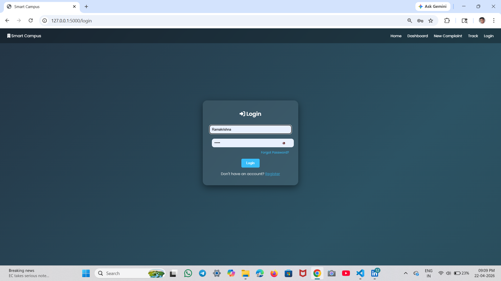
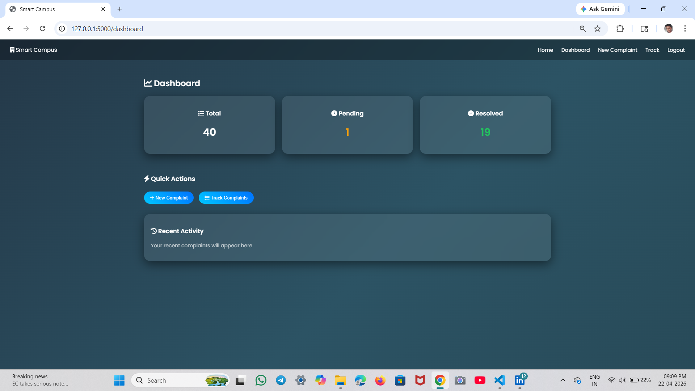
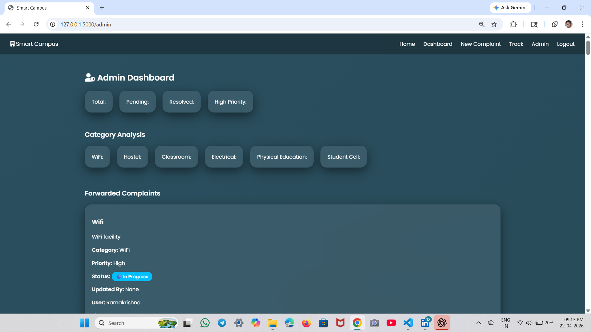

 # 🎓 Smart Campus Complaint Management System

A web-based complaint management system developed to streamline complaint registration, tracking, and resolution inside educational institutions.

This system enables students to submit complaints digitally while allowing **In-charge** and **Admin** to efficiently review, assign, and resolve issues in a structured workflow.

## 🚀 Features

### 👨‍🎓 Student Module
- User Registration & Login
- Submit Complaints
- Upload Complaint Images
- Track Complaint Status
- Forgot Password Functionality
- Email Notifications

### 👨‍💼 In-Charge Module
- Review Submitted Complaints
- Forward Complaints to Admin
- Monitor Complaint Progress

### 👨‍💻 Admin Module
- View All Complaints
- Assign Complaints to Workers
- Update Complaint Status
- Manage Complaint Resolution

## 🛠️ Tech Stack

### Frontend
- HTML5
- CSS3
- Bootstrap

### Backend
- Python
- Flask

### Database
- SQLite

### Other Tools
- SMTP (Email Notification)
- Git & GitHub

## 📌 Project Workflow

Student
   ↓
Submit Complaint
   ↓
In-Charge Review
   ↓
Admin Assignment
   ↓
Worker Resolution
   ↓
Complaint Closed

## 📂 Project Structure

SMART-CAMPUS-COMPLAINT-SYSTEM/
│── static/
│   └── uploads/
│
│── templates/
│   ├── admin.html
│   ├── base.html
│   ├── complaint.html
│   ├── dashboard.html
│   ├── forgot.html 
│   ├── incharge.html
│   ├── index.html
│   ├── login.html
│   ├── register.html
│   └── track.html
│
│── app.py
│── database.db
│── init_db.py
│── requirements.txt
│── README.md
│── .gitignore

## Project Screenshots

### Login Page

### Student Dashboard

### Admin Dashboard

